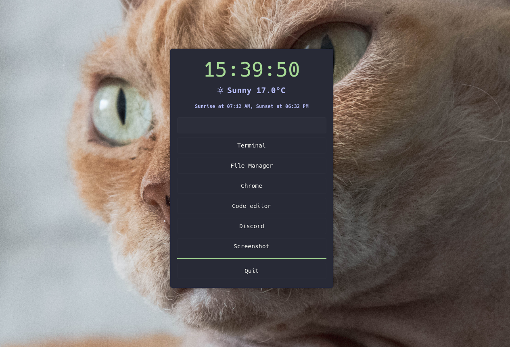

# Oscar-launcher - One Simple Configurable Action Runner
Oscar-launcher is a simple and configurable launcher that allows you to quickly execute commands, launch applications, or display the output of Bash scripts. 

It's designed to be flexible, easy to configure, yet simple enough making it perfect for those who love to customize their workflow.

## Attention
This is my first attempt at making something somewhat useful on Linux.
It may be broken, wrongly implemented or simply a bad idea.
Keep that in mind.


## Why
I always struggled to configure Rofi (and similar other) to my liking, it felt way too complicated.

I also wanted to try to play with Python and GTK4.

I now use `oscar-launcher` for everything, i removed my status bar and rofi.

This is what my desktop look like (Oh and meet my cat ... `oscar`)




## Installation
If you are an Arch user you can install it via the [AUR - oscar-launcher-git](https://aur.archlinux.org/packages/oscar-launcher-git)

## Usage

`oscar-launcher --init` will start a daemon then you can use `oscar-launcher --open {name}` to open a specific launcher.

`oscar-launcher --help` will show you all the commands


## Configuration
Create a new configuration file `:name.json` into `~/.config/oscar`.

- **width** (optional) : Width of the window (default: `400`)
- **height** (optional) : Height (minimum) of the window (default: `0`)
- **timeout** (optional) : Close the window after some time (in seconds, default: `0` ... will not close automaticly)
- **theme** (optional) : Choose a theme for the window, (default: `default`)
- **items**: A list of [items](#items)
```json
{
    "title": "Title",
    "width": 400,
    "height": 0,
    "timeout": 0,
    "theme": "default",
    "items": []
}
```

## items

### Runner
Runner allow you to run a command manually
- **type** : `runner`
- **label** (optional) : Label on top of the input
- **class_name** (optional) : Name of a CSS class for stylingwindow
```json
{
    "type": "runner",
    "label": "Run a command",
    "class_name": "runner"
}
```


### Button
Button is the more useful one
- **type** (optional) : default `button`
- **label** (optional) : Label of the button
- **shortcut** (optional) : One character you can use as a shortcut once the window is open
- **class_name** (optional) : Name of a CSS class for styling
- **command** (optional) : A command to run, leave it empty if you want to quit the window
```json
{
    "type": "button",
    "label": "Oscar Github page",
    "shortcut": "o",
    "class_name": "firefox",
    "command": "firefox https://github.com/dimitri-gigot/oscar-launcher"
}
```


### Output
Output is useful if you want to display information.

For example, this shows the time and it runs every second.

- **type** : `output`
- **label** (optional) : Label, it will be replace by the output of the command
- **class_name** (optional) : Name of a CSS class for styling
- **interval** : Define some interval to run the command again (default: `0`)
- **command** : A command to run

```json
{
    "type": "output",
    "label": "Clock",
    "class_name": "clock",
    "interval": 1,
    "command": "date '+%H:%M:%S'"
}
```


### Text
Text is a simpler way to display text.

For example, this shows "hello world".

- **type** : `text`
- **text** : The text you want to display
- **class_name** (optional) : Name of a CSS class for styling

```json
{
    "type": "output",
    "text": "hello world",
    "class_name": "hello-world",
}
```


### Group
Group other items together

- **type** : `group`
- **class_name** (optional) : Name of a CSS class for styling
- **items**: A list of [items](#items)
- **orientation** (optional) : Orientation  `horizontal` or `vertical` (default: `horizontal`)
```json
{
    "type": "group",
    "class_name": "group",
    "items": [
        //list of items
    ],
    "orientation": "horizontal"
}
```


### Separator
Display a separator line

- **type** : `separator`
- **class_name** (optional) : Name of a CSS class for styling

```json
{
    "type": "separator",
    "class_name": "separator"
}
```

## Theme
You can use CSS to theme `oscar-launcher`

Oscar-launcher come with 3 themes, `dark`, `light` and `default`

Every component has a specific class_name by default, the class_name you defined in the configuration is added.

```
 _ .main
 |_ .widget .widget__{{type}} .{{class_name}}
```

To create a new theme, create a new file in `~/.config/oscar-launcher/themes/:theme_name/style.css`.


## Issues

Depending on your Desktop Manager, it might not open in a floating window.
You might want to add rule for that.